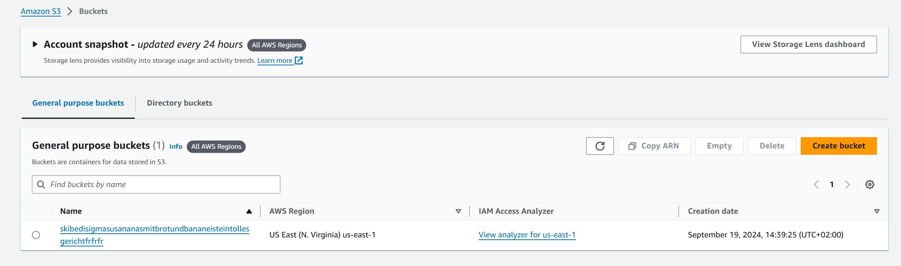

# KN-02 - Lab 4.1 / Lab 4.3

## Aufgaben: Lab 4.1


**Aufgabe: 1** <br>
 <br>
**Aufgabe: 2** <br>
 <br>
**Aufgabe: 3** <br>
 <br>
**Aufgabe: 4** <br>
 <br>

## Aufgaben: Lab 4.1

**Aufgabe: 1** <br>
 <br>
**Aufgabe: 2** <br>
 <br>
**Aufgabe: 3** <br>
 <br>
**Aufgabe: 4** <br>
 <br>
**Aufgabe: 5** <br>


## Zugriff mit SSH-Key (40%)

**Aufgabe: 1** <br>
 <br>
**Aufgabe: 2** <br>
 <br>
**Aufgabe: 3** <br>
 <br>


````
{
    "Version":"2012-10-17",
    "Statement":[
        {
            "Sid":"PublicReadGetObject",
            "Effect":"Allow",
            "Principal":"*",
            "Action":[
                "s3:GetObject"
            ],
            "Resource":[
                "arn:aws:s3:::example-bucket/*"
            ]
        }
    ]
}
```
