# KN-04 

## Aufgabe: A  

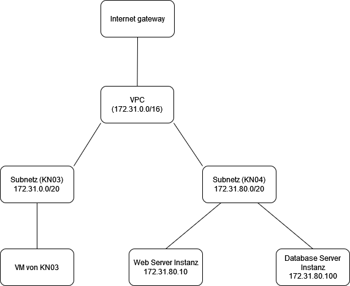  

VPC (Virtual Private Cloud):
Eine VPC ist ein isoliertes Netzwerk in der Cloud, das es dir ermöglicht, Ressourcen wie Server und Datenbanken sicher zu verbinden und zu verwalten. Sie verhält sich ähnlich wie ein privates Netzwerk in einem Rechenzentrum, jedoch in der Cloud.

Subnetz:
Ein Subnetz ist ein kleineres, untergeordnetes Netzwerk innerhalb einer VPC. Es teilt das größere Netzwerk in logisch getrennte Bereiche auf, um die Verwaltung, Sicherheit und Leistung zu optimieren.

**Aufgabe: B**  

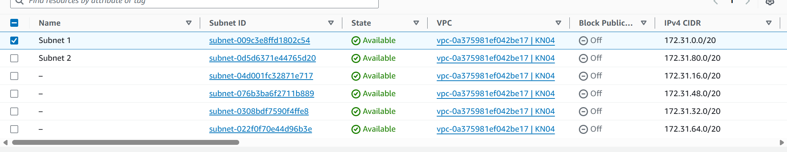

IP's für DB / Web-Server instanz:
172.31.80.100
172.31.80.10

**Aufgabe: C**  

**Security Group für Web-Server**  
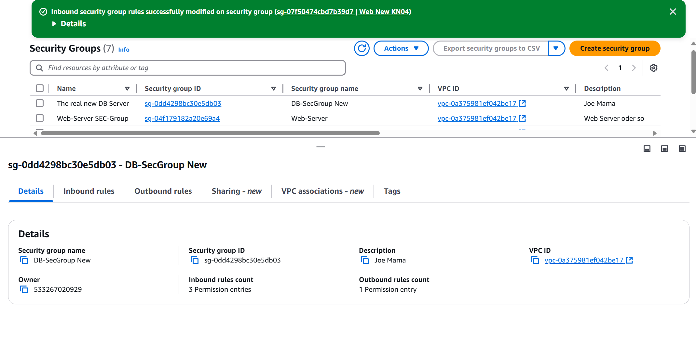

**Security Group für DB-Server**  
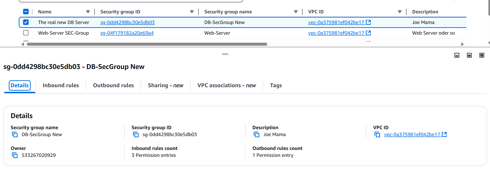  
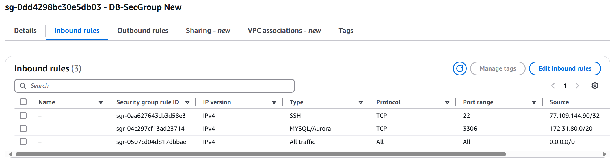  
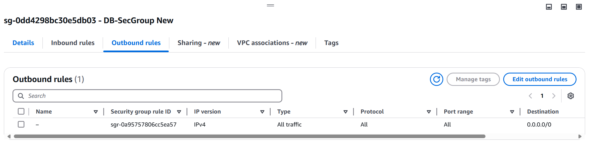  

**Screenshots der Liste der Instantzen wenn beide Instanzen gestoppt sind.**  
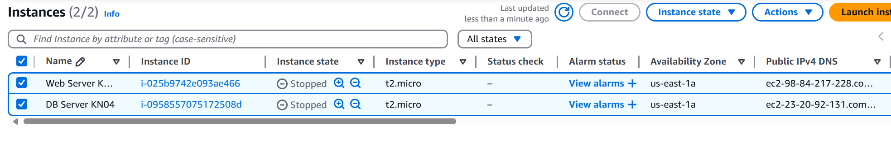  
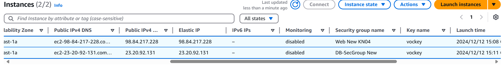  

**Screenshot der Details beider Instanzen, so dass die Subnet ID sichtbar ist.**  
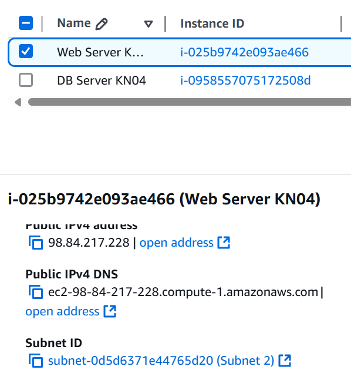
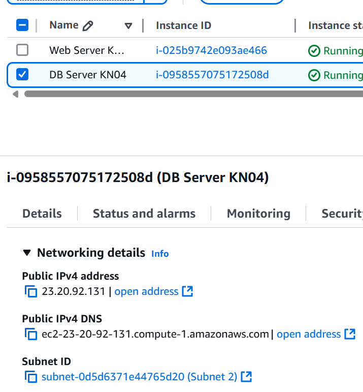

**Sreenshot der 3 Seiten**  
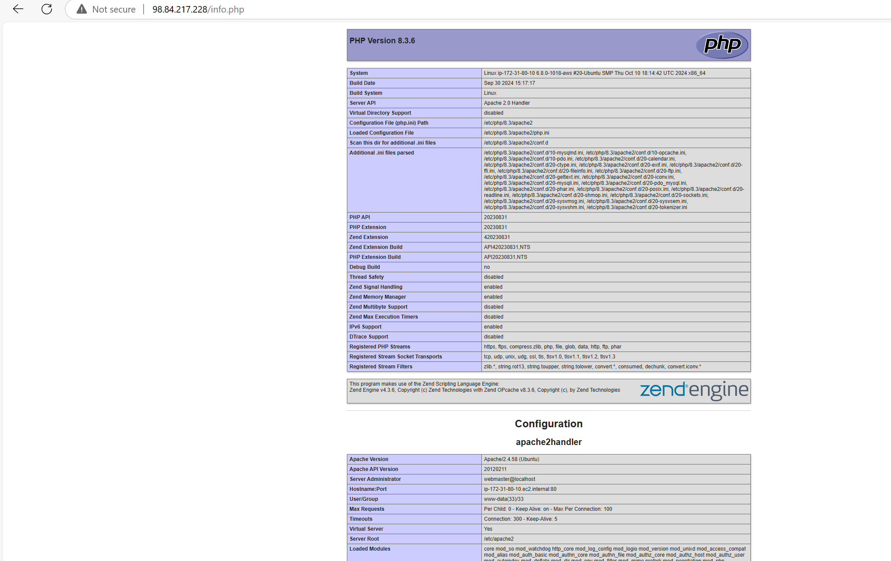
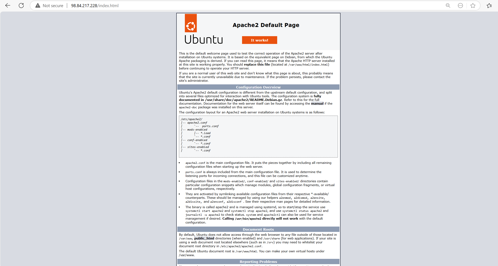
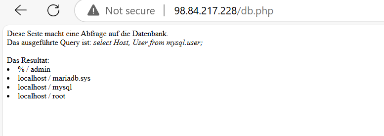
