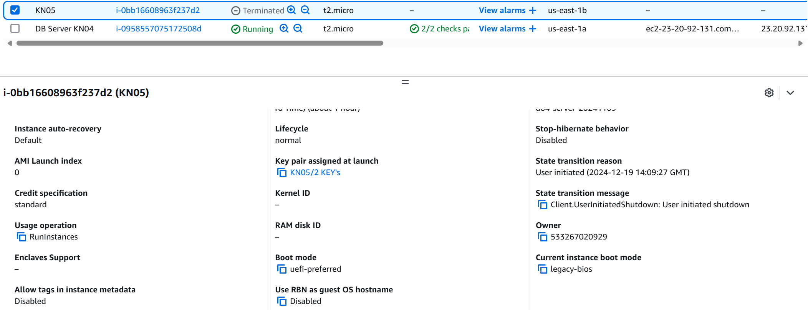
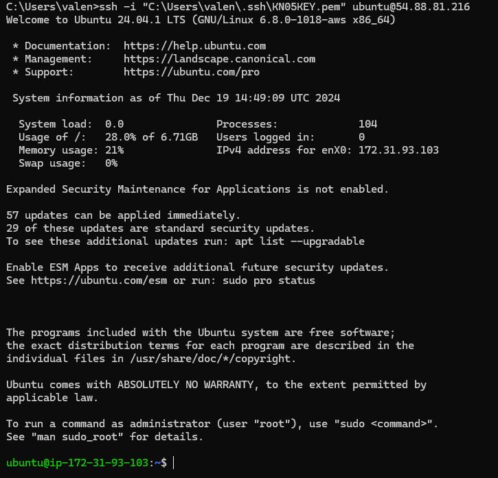
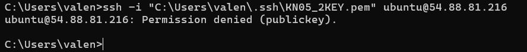
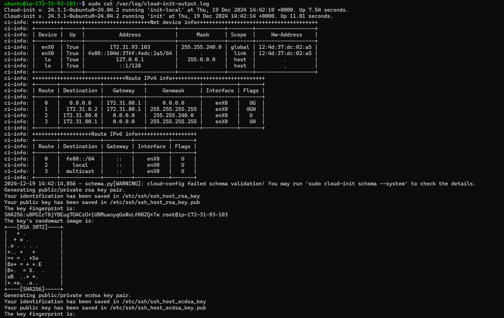

# KN-05 

## Aufgabe: A  
Cloud Init Datei hochgeladen... (cloud_init.yaml)  

## Aufgabe: B  

Cloud Init Datei hochgeladen... (cloud_init.yaml)  

Ein Screenshot der Details der Instanz. Scrollen Sie so weit runter, dass das Feld "Key pair assigned at launch", sichtbar ist:  
  

Screenshot mit dem ssh-Befehl und des Resultats unter Verwendung des ersten Schlüssels.  
  

Screenshot mit dem ssh-Befehl und des Resultats unter Verwendung des zweiten Schlüssels.  
  

Screenshot mit dem Auszug aus dem Cloud-Init-Log. Der Befehl den Sie aufgerufen haben und der obere Teil des Logs sollten sichtbar sein. Sie müssen nicht das gesamte Log abgeben.  
  

## Aufgabe: C  

Datei hochgeladen... (cloud_initWithTeacher.yaml)  

## Aufgabe: D  

Datei hochgeladen... (cloud_init-db.yaml)  
Datei hochgeladen... (cloud_init-web.yaml)  
**db.php:** 
  

**info.php:**
  

**index.html:** 
  

**adminer:**
  
