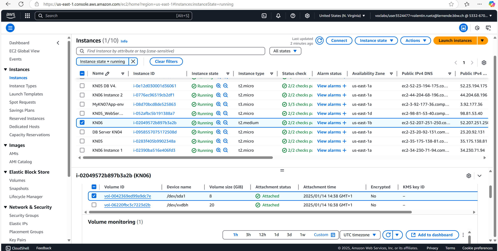
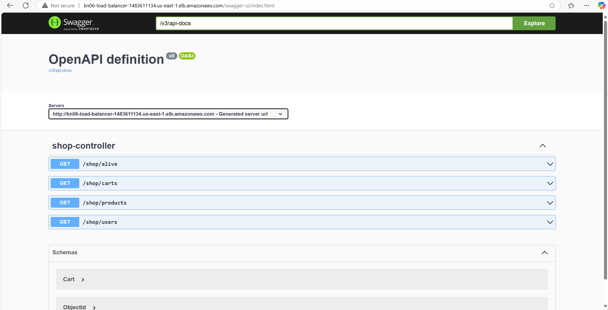

## Aufgabe A:

Ein Reverse Proxy ist ein System, welches Anfragen von clients annimmt und sie an "interne" instanzen weiterleitet, ohne dass die clients etwas merken. Ein Reverse Proxy verbessert die Sicherheit, skalierbarkeit von Systemen.  

 
  

  

  

**Schauen Sie sich das Cloud-Init genau an. Welche(r) Teil(e) macht/machen hier überhaupt keinen Sinn in einer produktiven Umgebung:**
Username und passwort sind hardcoded, dies ist NIE eine Gute Idee.

## Aufgabe B:

**Vorher:**  

Zuerst Erstelle ich ein Elastic-Block Storage Volume in der Grösse 20gb. Anschliesend "attache" ich das Volume an meiner EC-2 instanz.

Zuerst Stoppe ich die Instanz. Danach ändere ich den Instanz-Typ unter "Actions", "Instance-Settings", "Change-InstanceType" den Instanz-Typ auf T2-Medium.

## Aufgabe C: 

**Erklärung DNS:**
Der AWS Load Balancer bekommt einen eigenen DNS-Namen, über den er erreichbar ist, weil sich seine IP's ständig ändern. Damit man trotzdem einfach darauf zugreifen kann, verbindet man den DNS-Namen mit einer eigenen Domain.

Swagger via DNS:

## Aufgabe D: 

Nich fertig bekommen.