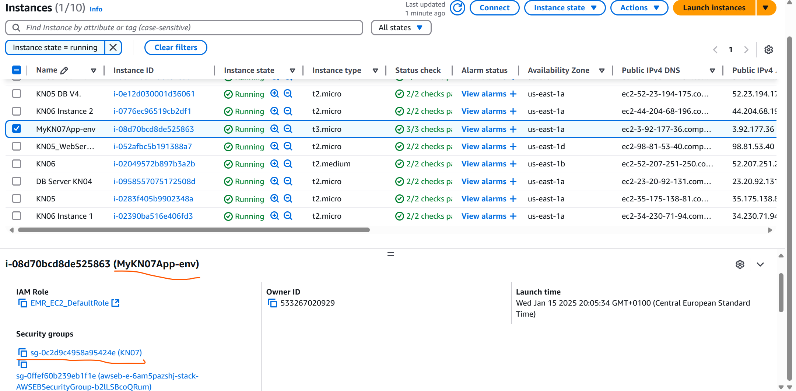
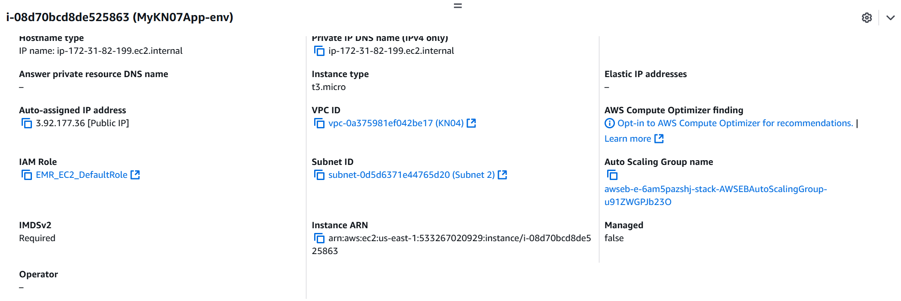
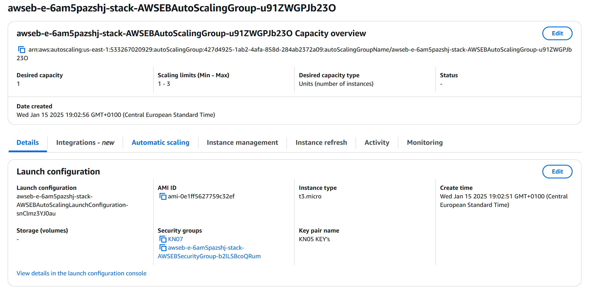
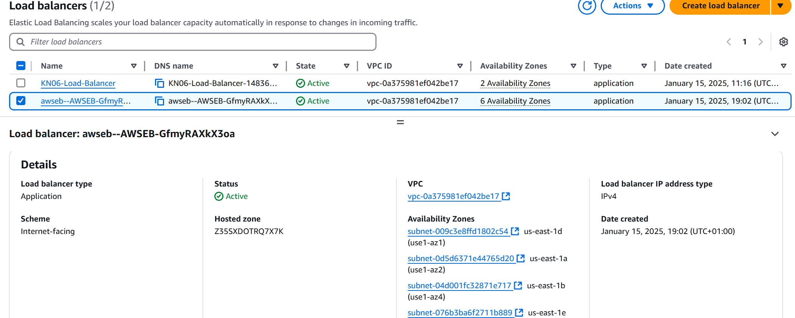
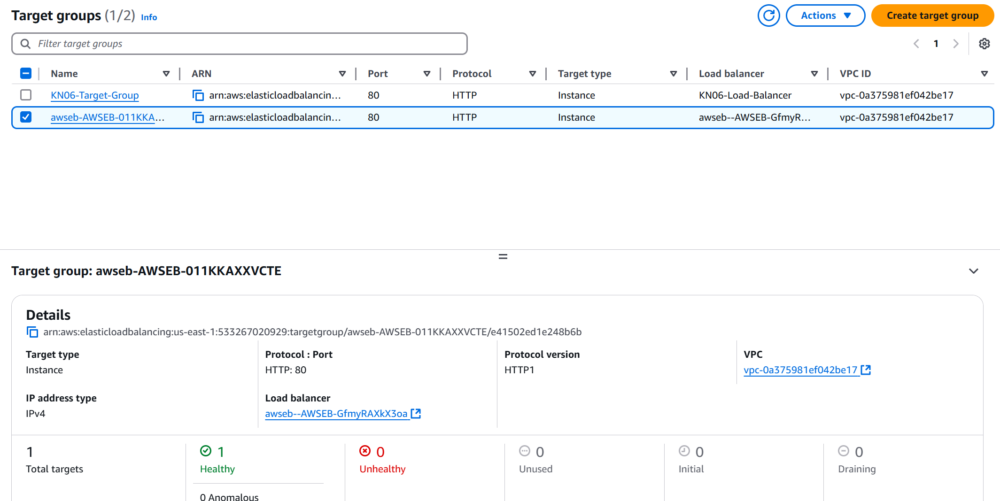
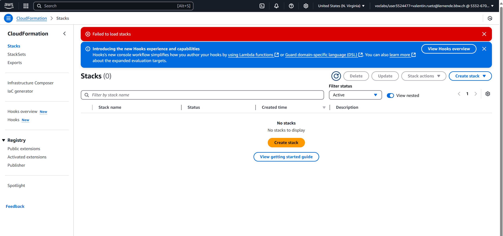

## Aufgabe A:

  

**Warum es besser ist einen PAAS, SAAS zu nutzen:**  
Die Nutzung von PaaS / SaaS-Services spart Zeit und Aufwand. Die Anbieter kümmern sich um Installation, Wartung und Skalierung. 

## Aufgabe B:

Zuerst habe ich eine geignette Plattform für meine App ausgewählt, in diesem fall Node.js.  
  
Daraufhin habe ein Key-Pair für meine PaaS instanz gewählt.  
  
Im Anschluss habe ich das Auto-Scaling konfiguriert, ich habe die min / max instanzen gewählt, und den Scaling-Trigger definiert.  
In meinem Fall "Scaled" die Applikation sobald die CPU-Last über 80% ist.  

Dann habe ich meine Loadbalancer konfiguriert, das Montioring "Enabled", den "Patch-Timeframe" definiert und meine E-Mail hinterlegt um wichtige Nachrichte bezgl. VM zu kriegen.  
  
  
  
  
  

## Aufgabe C:

KN07-Sec. Group

KN07-Auto-Scaling

KN07-Load-Balancer:

KN07-Target group: 

**Was ist CloudFormation:**
CloudFormation ist ein AWS-Dienst, mit dem Infrastruktur als Code definiert und automatisch bereitgestellt wird. Im Unterschied dazu wird Cloud-Init direkt auf virtuellen Maschinen ausgeführt, um sie während des Startvorgangs zu konfigurieren.

