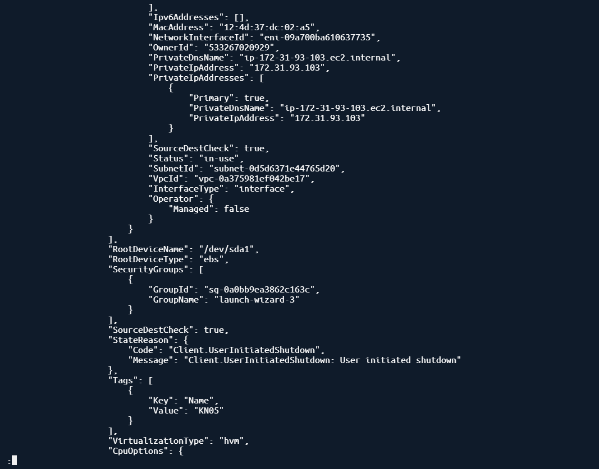
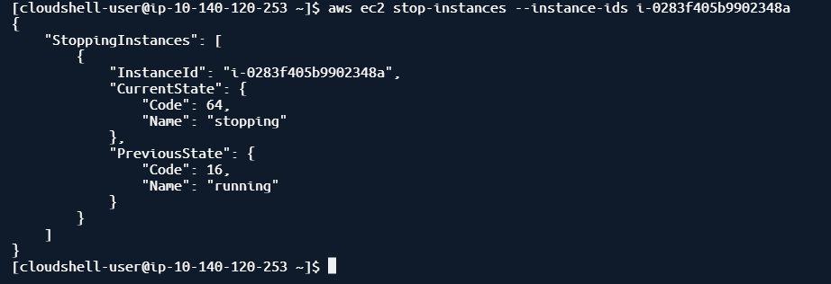
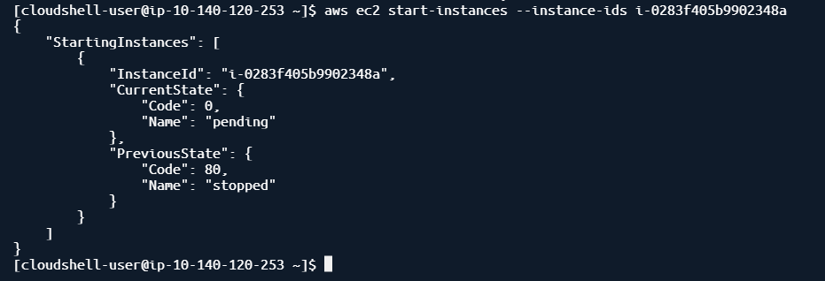
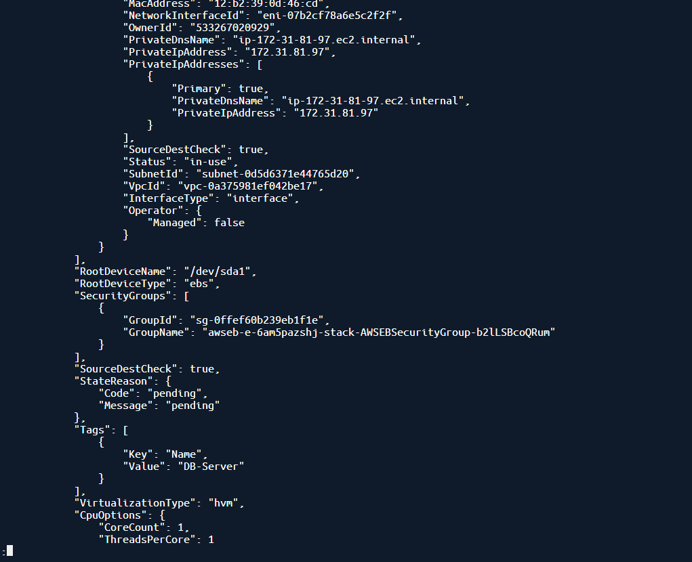
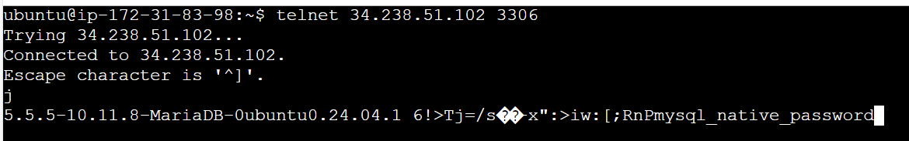

Detail KN05 Instance: 
aws ec2 describe-instances --instance-ids i-0283f405b9902348a

Stop KN05:
aws ec2 stop-instances --instance-ids i-0283f405b9902348a 

Start KN05:
 aws ec2 start-instances --instance-ids i-0283f405b9902348a 

DB-Server Erstellt: 

aws ec2 run-instances --image-id ami-04b4f1a9cf54c11d0 --count 1 --instance-type t2.micro --key-name vockey --security-group-ids sg-0ffef60b239eb1f1e --subnet-id subnet-0d5d6371e44765d20 --user-data file:///home/cloudshell-user/cloud-init-db.yaml --tag-specifications 'ResourceType=instance,Tags=[{Key=Name,Value=DB-Server}]'

Telnet Check: 

