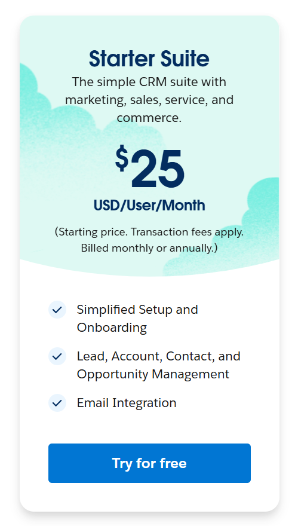

# KN-03 - A / B

## Aufgabe: A 

**AWS:**  

**Gesamtpreis:**  
  
     
**CPU, RAM | Webserver:**  
  
**Storage | Webserver:**  
  
**CPU, RAM | DB-Server:**  
  
**Storage | DB-Server:**  
  
**Backup:**  
  
**Erklärung:**  
Für den Webserver habe ich mich entschieden, eine Instanz mit 2vCPUs sowie einem gigabyte ram auszuwählen. Dies dürfte mehr als genug Leistung sein um die Webseite zu hosten, während wir immernoch gewisse Leistungreserven haben. Der Webserver wird mit einer 20 gigabyte HDD ausgerüstet. Ich habe mich für eine HDD entschieden, da der Webserver nur eine Webseite hosten muss und dementsprechend keine schnelle Datenabfrage braucht. Desweiteren sind HDD's um einiges günstiger.

Der Database-Server hat 2 vCPUs so wie 2 Gigabyte RAM. Dies sollte mehr als genug Leistung sein um die Datenbankabfragen zu bearbeiten. Als Speicher hat der Database-Server eine 100GB SSD. 

Der Backup-Service speichert in regelmässigen Abständen den Inhalt des DB-Server's. Er ist nach den Angaben des Kunden konfiguriert.

Zusammengefasst:

Die gewählte Konfiguration unterscheidet sich von einer On-Premise-Infrastruktur durch die Optimierung der Kosteneffizienz und Flexibilität.
Ein weiterer Vorteil liegt in den Speichermethoden: Statt kostspieliger lokaler Speicherlösungen werden kosteneffiziente Cloud-Speicher (HDDs/SSDs) verwendet, die speziell auf die Anforderungen der jeweiligen Geräte (Webserver / Datenbank) abgestimmt sind. Auch der Backup-Service ist mit AWS einfacher zu konfigurieren und erfordert keine zusätzliche Hardware, was im On-Premise-Setup zusätzliche Kosten mit sich bringen würde.

**Azure:**  

**CPU, RAM | Webserver:**  
 
**Storage | Webserver:**  
 
**CPU, RAM | DB-Server:**  
  
**Storage | DB-Server:**  
  
**Backup:**  
  
**Erklärung**  
Für den Webserver habe ich mich entschieden, eine Instanz mit 1 Core sowie 2 Gigabyte RAM auszuwählen. Dies dürfte mehr als genug Leistung sein um die Webseite zu hosten. Der Webserver wird mit einer 32 gigabyte HDD ausgerüstet. Ich habe mich für eine HDD entschieden, da der Webserver nur eine Webseite hosten muss und dementsprechend keine schnelle Datenabfrage braucht. Desweiteren sind HDD's um einiges günstiger.

Der Database-Server hat 2 Cores so wie 2 Gigabyte RAM. Dies sollte mehr als genug Leistung sein um die Datenbankabfragen zu bearbeiten. Als Speicher hat der Database-Server eine 128GB SSD. 

Der Backup-Service speichert in regelmässigen Abständen den Inhalt des DB-Server's. Er ist nach den Angaben des Kunden konfiguriert.

Zusammengefasst:

Die gewählte Konfiguration unterscheidet sich von einer On-Premise-Infrastruktur durch die Optimierung der Kosteneffizienz und Flexibilität.
Ein weiterer Vorteil liegt in den Speichermethoden: Statt kostspieliger lokaler Speicherlösungen werden kosteneffiziente Cloud-Speicher (HDDs/SSDs) verwendet, die speziell auf die Anforderungen der jeweiligen Geräte (Webserver / Datenbank) abgestimmt sind. Auch der Backup-Service ist mit Azure einfacher zu konfigurieren und erfordert keine zusätzliche Hardware, was im On-Premise-Setup zusätzliche Kosten mit sich bringen würde. 

## Aufgabe: B
**Web-Server**  
  
**DB-Server / Backup**  
  
**Erklärung**  
Für den Web-Server habe ich mich entschieden, das Standart-Paket zu nutzen, da es genug Leistung hat, um die Webseite zu hosten, aber immer noch auf der günstigeren Seite ist.

Der Database-Server hat mit 4 Gigabyte RAM eine angemessene Leistung um die Database zu betreiben, auch die 100+ Connections / niedrige Downtime sind sehr vorteilhaft. Ausserdem hat das Paket auch einen Backup-Service.

Zusammenfassung:

Für den Web-Server wurde das Standard-Paket gewählt, da es kostengünstig und leistungsstark genug für das Hosting ist. Der Database-Server hat mit 4 GB RAM ausreichende Leistung, unterstützt über 100 gleichzeitige Verbindungen, hat geringe Downtime und einen integrierten Backup-Service. Im Vergleich zur On-Premise-Lösung bietet die Cloud-Lösung mehr Flexibilität. Zudem entfallen hohe Anschaffungskosten und Wartungskosten, da alles vom Anbieter verwaltet wird. Die Cloud gewährleistet zudem hohe / globale Verfügbarkeit und integrierte Backups, während On-Premise an einen Standort gebunden und technisch aufwendiger ist. Zusammengefasst: Die Cloud-Lösung reduziert die Kosten und erhöht Effizienz und Zuverlässigkeit.

## Aufgabe: C
**Zoho CRM:**  
  
**Grund für Auswahl:**  
Bei Zoho habe ich mich für die "Professional" Edition entschieden, da sie viele Features hat, nur 9 Franken teurer ist als die standart Version (Aufpreis zur "Enterprise" Version wären 17 Fr.). Desweiteren bietet sie viele extra Features wie "Email-Integration", "Bestandsmanagement" etc.

**Salesforce CRM:**  
  
**Grund für Auswahl:**  
Bei Salesforce habe ich mich für die "Starter Suite" entschieden, da sie mit abstand die gunstigste Edition ist (die nächst-günstigte Variante kostet 100 Fr.) und trotzdem alle grundlegenden Features hat die von einer CRM-Suite erwartet warden. 

## Aufgabe: D
### Erster Punkt: Vergleich der Modelle und Kosten

#### **Kostenanalyse für die Migration in die Cloud**

Die Firma betreibt eine On-Premise-CRM-Software. Für eine Migration in die Cloud gibt es drei Ansätze: **Rehosting**, **Replatforming** und **Repurchasing**.   

---

#### **1. Rehosting**  
Bei Rehosting wird die bestehende Infrastruktur direkt in die Cloud übertragen, ohne Änderungen an der besthenden Sofware vorzunehmen.  

**Kosten:**  
- Entspricht +- den laufenden On-Premise-Kosten, jedoch kommen Cloud-spezifische Gebühren hinzu:  
  - **AWS/Azure/Heroku:** Virtuelle Maschinen (zb. EC2-Instanzen), Speicher (SSD/HDD), Netzwerkverkehr und Backups.  
  - **Zusätzliche Kosten:** Mögliche Anpassungen, um die Anwendung in der Cloud lauffähig zu machen.  

**Vorteile:**  
- Schnell umsetzbar.  
- Einfache Migration in die Cloud.  

**Nachteile:**  
- Geringe Optimierung in Bezug auf Cloud-Ressourcen, daher ineffizient.  
- Relativ begrenzte Flexibilität, wenn die Anforderungen wachsen.  

---

#### **2. Replatforming**  
Hier wird die Software für eine die Cloud-Plattform leicht angepasst, um spezifische Vorteile der Cloud-Plattform zu Nutzen.

**Kosten:**  
 - **Initiale Kosten:** Aufwand für die Anpassung der Sofware und der Datenbank.  
 - **Laufende Kosten:** Nutzung von cloud-optimierten Diensten.  
  - Dies Modell ist günstiger als Rehosting, da ressourcen effizienter genutzt werden.  

**Vorteile:**  
- Besser Cloud-Integration, dementsprechend auch eine höhere Effizienz.  
- Systeme sind Flexibel anpassbar für zukünftige Anforderungen.  

**Nachteile:**  
- Der Aufwand und Zeitbedarf ist höher als beim Rehosting.  
ß
---

#### **3. Repurchasing**  
Hier wird die bestehende CRM-Lösung durch eine fertige Cloud-Software ersetzt.  

**Kosten:**  
- **Abonnement-Kosten:**  
  - Zoho-CRM: 29 Fr. pro Benutzer/Monat ("Professional" Edition) = 870Fr. /Monat für 30 Benutzer.  
  - Salesforce CRM: 100 Fr. pro Benutzer/Monat ("Starter Suite") = 3'000Fr. /Monat für 30 Benutzer.  
- **Migration:** Mit diese Modell entstehen extra kosten / aufwand für die Datenmigration aus der bestehenden Software.  

**Vorteile:**  
- Es ist keine Wartung der Infrastruktur erforderlich.  
- Vollumfänglicher zugriff auf moderne CRM-Funktionen (möglicherweise nicht in alter Software vorhanden).  
- Modell ist einfach skalierbar.  

**Nachteile:**  
- Sofware kann nicht mehr individuel angepasst werden, so wie bei der bisherigen Lösung.  
- Markant höhere laufende Kosten als bei selbst entwickelter Software.  

---

### **Vergleich der Kosten (Grobe schätzungen):**

| **Modell**          | **Initiale Kosten (Migration)**| **Laufende Kosten (Monat)** | **Aufwand (Zeit/Fachwissen)**      |
|---------------------|--------------------------------|-----------------------------|------------------------------------|
| **Rehosting**       | Mittel (Einrichtung)           | 50–400 Fr.                  | Niedrig bis Mittel (Basiswissen)   |
| **Replatforming**   | Hoch (Anpassungen)             | 50–400 Fr.                  | Hoch (IT-Fachwissen notwendig)     |
| **Repurchasing**    | Mittel (Datenmigration)        | 870–3'000 Fr.               | Niedrig (Benutzer-Training)        |

---

### Zweiter Punkt – Aufwand und Empfehlungen

#### **Rehosting:**
- **Aufwand:** Der Aufwand fürs Rehosting ist relativ gering, da die bestehende Anwendung weitgehend unverändert bleibt.Nur die Cloud-Infrastruktur muss eingerichtet werden.  
- **Empfehlung:** Diese Lösung ist für schnelle Ergebnisse geeignet, jedoch wenig effizient. Empfohlen, wenn kurzfristig das ganze Kurzfristif eingerichtet werden muss, langfristig teurer.  

#### **Replatforming:**
- **Aufwand:** Der Aufwand ist höher, da Anpassungen an der Software notwendig sind. Dies benötigt Entwickler mit Erfahrung in der Cloud-Integration.  
- **Empfehlung:** Diese Lösung ist Ideal, wenn langfristig geplant wird, da es Kosteneffizienz und Plattform-Skalierbarkeit vereint.  

#### **Repurchasing:**
- **Aufwand:** Datenmigration und Schulung der Mitarbeiter in der neuen Software sind notwendig. Jedoch ist wenig technisches KnowHow erforderlich.  
- **Empfehlung:** Diese lösung ist optimal für den Wechsel zu einer modernen und wartunsarmen Lösung, ist jedoch mit höheren laufenden Kosten verbunden.  

---

### Fazit für den CEO: 

Der CEO sollte folgende Punkte Berücksichtigen bevor er eine Entscheidung trifft:  
1. **Budget:** Wie viel darf die Lösung einmalig & langfristig kosten?  
2. **Flexibilität:** Ist die bestehende CRM-Software ausreichend, oder sind neue Funktionen notwendig?  
3. **Expertise:** Verfügt die Firma über die Ressourcen für eine Migration und Anpassung (Replatforming) oder muss dies bei Externen in Auftrag gegeben werden?  

**Empfohlene Strategie:**  
- Wenn **geringes Budget** und schnelle Ergebnisse: **Rehosting**.  
- Wenn **langfristige Kosteneffizienz** und Erweiterbarkeit: **Replatforming**.  
- Wenn **moderne Funktionen** und einfache Verwaltung: **Repurchasing**.  

